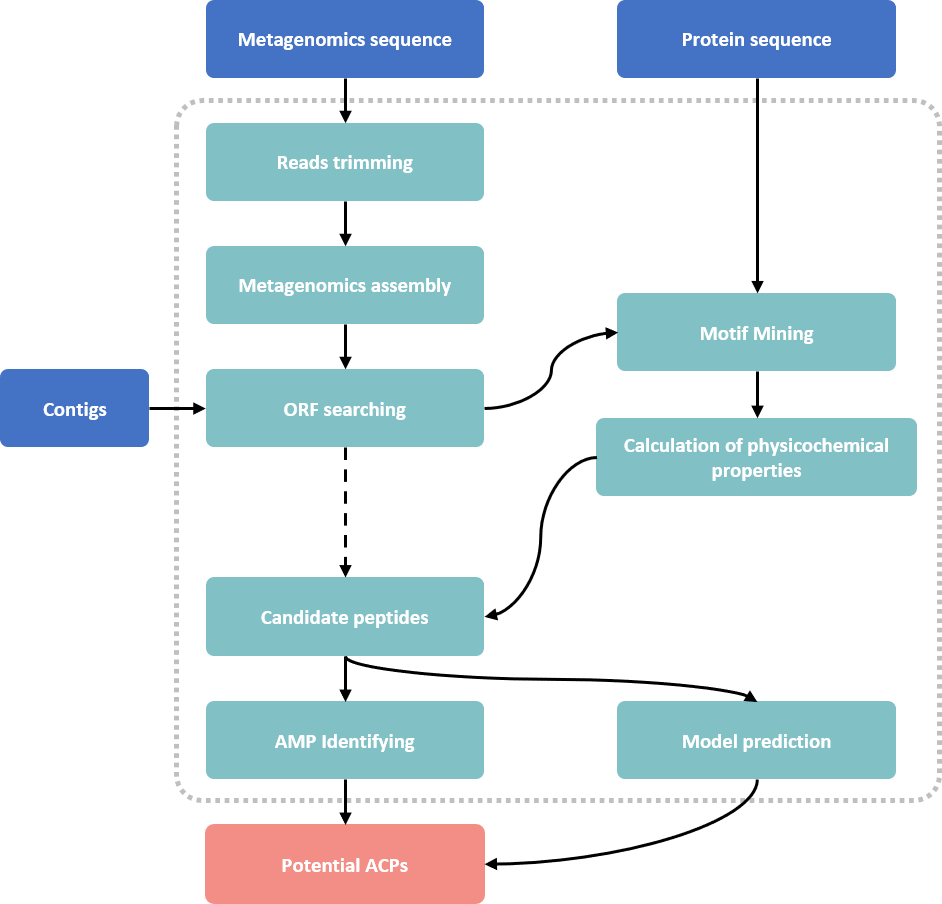

# m(Meta)AMPfinder v.1.1.0
To provide more opportunities for clinical solutions, we were thus motivated to design a homology-based gene prediction program (AMPfinder), an integrated tool stream that combines ORF prediction, and AMP classification to extract AMPs directly from genome or proteome sequence data.

1. AMPfinder is a simple, yet accurate, computational pipeline that processes either genomes and proteome sequences. The search for AMPs is based on alignment searching the existing antimicrobial peptide database and predicting on the feature model in amino acid sequence obtained from the translation of the original transcriptome sequence data. 

2. AMPfinder is a free software tool that combines ORF prediction and accurately classification of the AMPs from protein or nucleotide data, which performs translation of the input transcriptome data by using Prodigal, and selects short sequences containing ORF and signal peptide cleavage sites. Then, by default, DIAMOND and BLAST were used for homology detection and machine learning prediction model were used to search for potential AMPs, in which case all known or potential motifs will be revealed and classified. Due to the combination of various search methods, AMPfinder searcher allows to obtain the most complete repertoire of AMPs for one or more transcriptomes in a short amount of time. Therefore, AMPfinder seems to be the most suitable tool for rapid screening of potential AMPs.

##  Publications

> Jhong, J.H., et al., 
> dbAMP 2.0: updated resource for antimicrobial peptides with an enhanced scanning method for genomic and proteomic data. Nucleic Acids Res (2021).
> [10.1093/nar/gkab1080](https://doi.org/10.1093/nar/gkab1080)

## Install Development Version
### Install Dependencies
The following dependencies are required.
- python 3.8
- Biopython 1.79
- Fastp 0.23.0
- megahit 1.2.9
- Spades 3.15.5
- BLAST
- DIAMOND
- Prodigal 2.6.3
- modlamp 4.2.1
- scikit-learn 0.24.1
- pytest 3.0.0+

### Install AMPfinder

We have already integrate the environment in `conda_env.yaml`. 
execute `conda env create --file conda_env.yaml` to install packages required in a new created `AMPfinder` conda env.

Enter the enviornment with `conda activate AMPfinder` before further executions.

**Note**: Please ensure that all dependencies are installed before using AMPfinder

## Getting started
### Construct Database
We provide a JSON format file, **ampfinder_210729.json**, which contains AMP sequences from [dbAMP](https://awi.cuhk.edu.cn/~dbAMP/ "dbAMP"). You can directly use this file and run the following command to construct the database.

`macpfinder load --input_json ampfinder_210729.json`

Then you will see the following files in your directory of `db/`.
- _data/proteindb.fsa
- _db/protein_all.db.pin
- _db/protein_all.db.phr
- _db/protein_all.db.psq
- _db/protein_all.db.dmnd

### Running AMPfinder

We provided two test files: **example_protein.fasta** and **example_dna.fasta**. 
The following command will bring up AMPfinder's main help menu:

`python ampfinder main -h`

    AMPfinder - 1.1.0 - main
    
    optional arguments:
      -h, --help            show this help message and exit
      -i INPUT_SEQUENCE, --input_sequence INPUT_SEQUENCE
                            input file must be in FASTA (contig and protein) format! e.g myFile.fasta
      -o OUTPUT_FILE, --output_file OUTPUT_FILE
                            output folder and base filename
      -t {contig,protein}, --input_type {contig,protein}
                            specify data input type (default = contig)
      -a {DIAMOND,BLAST}, --alignment_tool {DIAMOND,BLAST}
                            specify alignment tool (default = BLAST)
      -n THREADS, --num_threads THREADS
                            number of threads (CPUs) to use in the BLAST search (default=48)
